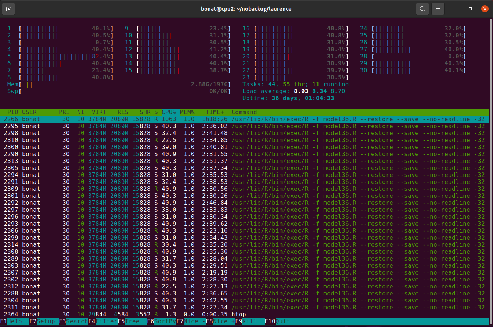

## About

[Twitter](https://twitter.com/hap_laureano) |
[Tumblr](tumblr/) |
[Spotify](https://open.spotify.com/user/12147941733) |
[CV](vitae.pdf) |
[LinkedIn](https://www.linkedin.com/in/henrique-laureano-025328179/)

Hi! I'm a brazilian from [Curitiba](https://goo.gl/K1Qcdv), Statistician
(BSc in Statistics @ [UFPR](https://goo.gl/DtVAbi), 2016) and MSc
student in Numerical Methods in Engineering @ UFPR under the guidance of
Professor [Wagner Bonat](http://www.leg.ufpr.br/~wagner/) and Professor
[Paulo Justiniano](http://leg.ufpr.br/~paulojus/).

What am I doing right now? (Jan 21)

+ Working on my master thesis,\
  in reality, studying random stuff while my models run on the
  university's server;

+ Making my new slides template\
  [pdf](THESIS/aqua/slides.pdf)
  ([.Rmd](THESIS/aqua/slides.Rmd) |
   [in_header file](THESIS/aqua/beamerheader.txt) |
   [TikZ style](THESIS/aqua/tikzit.sty));

+ Reading
  [Physics and Beyond](https://en.wikipedia.org/wiki/Physics_and_Beyond),
  by Heisenberg.

      [Courses](courses/) |
      [Stuff](stuff/) |
      [Presentations](presentations/) |
      [Papers](papers/)

## News

      Accepted in
      [Journal of Statistical Computation and Simulation](https://www.google.com/search?q=journal+of+statistical+computation+and+simulation):
      

**Unit gamma mixed regression models for continuous bounded data**\
R. R. Petterle, C. A. Taconeli, J. L. P. da Silva, G. P. da Silva,
**H. A. Laureano**, W. H. Bonat

## Contact

[laureano@ufpr.br](laureano@ufpr.br) |
[henriquelaureano@outlook.com](<henriquelaureano@outlook.com)

<!-- font-size default: 14px -->

<a href="mike.html" style="float: right; font-size: 11px">
    Michael Scott</a>

