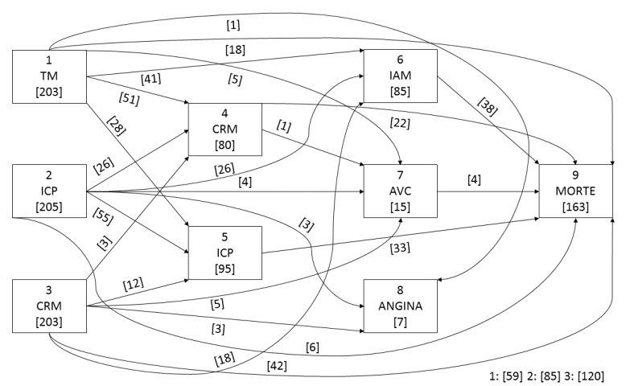

## Presentations

***

### [2016-10-05] [Multistate markovian models in survival analysis](multistate_markovian_models.pdf)

> Invited presentation in the course Topics in Survival Analysis @ UFPR,
> offered by Professor
> [Suely Giolo](https://docs.ufpr.br/~giolo/index.html)

***

### [2017-09-26] Presentation in the Bayesian Computational Statistics and Modeling research group

> [Introduction to R Markdown and knitr](rmd-rautu/)

***

### [2019-08-12] [Study group of Statistical Learning](islr/slides.pdf)

***

### [2019-12-16] LEG presentation

> [spde2smooth (with a link in the final slide to a html rmd with some code examples)](spde2smooth/slides.pdf)

***

### [2020-02-03/07] [I CiDWeek](http://cidamo.com.br/CiDWeek/)

> [Naive Bayes and Logistic Regression short course](cidamo/slides.pdf)

> [Master project presentation](cidamo/20min.pdf)

***

### Study group of Statistical Analysis of Failure Time Data

> [2020-01-28] [Failure Time Models](failure/cap2.pdf)

> [2020-02-21] [Relative Risk (Cox) Regression Model](failure/cap4.html)

> [2020-03-02] [Counting Processes and Asymptotic Theory](failure/cap5.pdf)

> [2020-03-20] [Competing Risks and Multistate Models](failure/cap8.pdf)

> [2020-04-01] [Modeling the CIF of mult. competing risks data allowing for within-cluster dependence of risk and timing](failure/paperslides.pdf)
