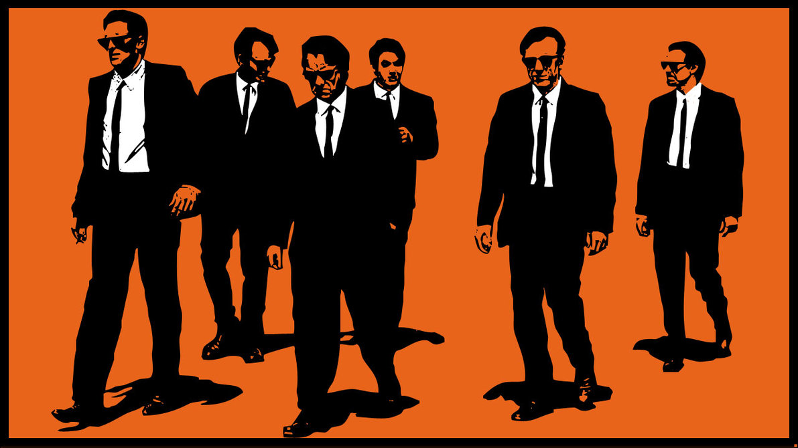
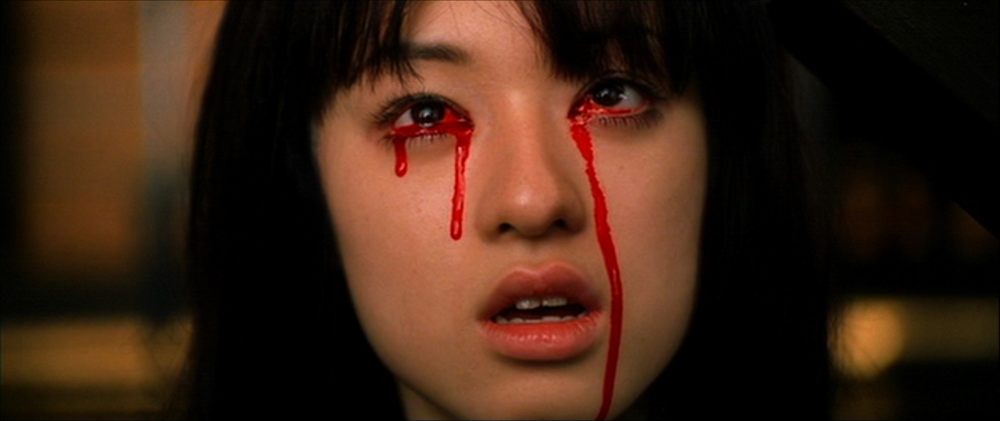
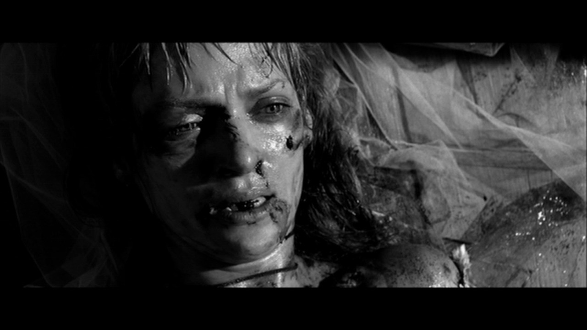

# Curse Words and Deaths in Quentin Tarantino's Film


***

> Henrique Aparecido Laureano

***

### Link for [FiveThirtyEight](http://fivethirtyeight.com/) article:

#### [A Complete Catalog Of Every Time Someone Cursed Or Bled Out
      In A Quentin Tarantino Movie](http://fivethirtyeight.com/
      features/
      complete-catalog-curses-deaths-quentin-tarantino-films/)
***

**All tihis code below is [R](https://www.r-project.org/) = )**

***

```{r, include=FALSE}
library(knitr)

opts_chunk$set(cache=TRUE
               , cache.path="cache/"
               , fig.path="iBagens/"
               , dpi=100
               , fig.align="center"
               , comment=NA
               , warning=FALSE
               , error=FALSE
               , message=FALSE)

options(width=100)
```

## Dataset

***

```{r}
path <- "C:/Users/henri/GitHub/mynameislaure.github.io/tarantino/"

da <- read.csv(paste0(path, "tarantino.csv")) ; summary(da)
```

> We have two events of interest: death or a curse, when it's a
  death, words are not said

> The dataset is composed of seven movies

***

## Wordcloud

***

```{r, fig.height=2.75}
library(wordcloud)

freq <- as.data.frame(table(subset(da, type == "word")$word))

names(freq)[1] <- "Word"

wordcloud(freq$Word, freq$Freq, min.freq = 1
          , col = 1:5)
```

> When the event is death no word is said

> We can classify curse words into four groups, based on the
  frequencies at which they are used. Each group is given by a
  different color

> The most spoken word, fucking, distances itself so much from the
  others in terms of frequency that it alone forms a group

> The second most common (most used) group consists of the words:
  n-word, fuck and shit

> The third most common group consists of the words: ass and
  goddamn

> `r length(levels(freq$Word)) - 1` words are spoken

***

## Minutes

***

```{r, fig.width=10, fig.height=11, results='hide'}
library(latticeExtra)

minutes.plot <- function(name, xl, yl, number){
  xyplot(
    ts(subset(da, movie %in% name)$minutes_in)
    , type = "h"
    , scales = list(
      x = list(at = xl), y = list(at = yl, rot = 0))
    , xlab = "Number of events", ylab = "Minutes"
    , main = paste0(name, " (", number, " events)")
    , ylim = c(0, max(yl))
    , col = ifelse(
      subset(da, movie %in%name)$type == "death", 2, "#0080ff")
  )
}
caes <-
  minutes.plot(
    "Reservoir Dogs", seq(0, 400, 100), seq(0, 100, 20), 431)
pulp <-
  minutes.plot(
    "Pulp Fiction", seq(0, 475, 115), seq(0, 150, 30), 476)
kill <-
  minutes.plot(
    "Kill Bill: Vol. 1", seq(0, 120, 30), seq(0, 100, 20), 120)
bill <-
  minutes.plot(
    "Kill Bill: Vol. 2", seq(0, 80, 20), seq(0, 120, 30), 80)
jack <-
  minutes.plot(
    "Jackie Brown", seq(0, 375, 90), seq(0, 150, 30), 372)
basts <-
  minutes.plot(
    "Inglorious Basterds", seq(0, 100, 25), seq(0, 150, 30), 106)
django <-
  minutes.plot(
    "Django Unchained", seq(0, 300, 75), seq(0, 160, 40), 309)

print(caes, c(0, 2/3, 1/3, 1), more = TRUE)
print(pulp, c(1/3, 2/3, 2/3, 1), more = TRUE)
print(kill, c(2/3, 2/3, 1, 1), more = TRUE)
print(bill, c(0, 1/3, 1/3, 2/3), more = TRUE)
print(jack, c(1/3, 1/3, 2/3, 2/3), more = TRUE)
print(basts, c(2/3, 1/3, 1, 2/3), more = TRUE)
print(django, c(1/3, 0, 2/3, 1/3))

library(grid)
draw.key(list(text = list(c("Curse word", "A death"))
              , lines = list(col = c("#0080ff", 2))
              , border = TRUE, padding.text = 5
              ), draw = TRUE, vp = viewport(x = .18, y = .17)
         )
```

**Among the things that we can say from the graphics above we
  have:**

> The longest movie is probably Django Unchained and the
  shortest is Reservoir Dogs

> The movie with most events is Pulp Fiction, 476 and the one
  with less is Kill Bill: Vol. 2, 80

> The movie with most deaths is Kill Bill: Vol. 1, and most of
  them were in sequence

> In the last thirty minutes of Pulp Fiction, approximately, there
  were no deaths

***

## Words by movie

***

```{r}
bars <- function(name){
  curse.word <- as.data.frame(sort(table(
    subset(da, movie == name & type == "word")$word)))
  death <- as.data.frame(sort(table(
    subset(da, movie == name & type == "death")$word)))
  names(curse.word)[1] <- names(death)[1] <- "Word"
  levels(curse.word$Word) <-
    ifelse(levels(curse.word$Word) == ""
           , "Death", levels(curse.word$Word))
  levels(death$Word) <-
    ifelse(levels(death$Word) == ""
           , "Death", levels(death$Word))
  bars.curse.word <-
    barchart(Word ~ Freq, subset(curse.word, Freq > 1)
             , col = "#0080ff"
             , border = "transparent"
             , xlab = NULL
             , main = paste0("Curse word (", table(
               subset(da, movie == name)$type == "word")[[2]]
               , " occurrences)")
             , scales = list(x = list(draw = FALSE))
             , xlim = c(0, max(
               subset(curse.word, Freq > 1)$Freq) + max(
                 subset(curse.word, Freq > 1)$Freq) * .13)
             , panel = function(...){
               panel.barchart(...)
               args <- list(...)
               panel.text(args$x, args$y, args$x, pos = 4)})
  bars.death <-
    barchart(Word ~ Freq, subset(death, Freq > 1)
             , col = 2
             , border = "transparent"
             , xlab = NULL
             , main = paste0("A death (", table(
               subset(da, movie == name)$type == "death")[[2]]
               , " occurrences)")
             , scales = list(x = list(draw = FALSE))
             , panel = function(...){
               panel.barchart(...)
               args <- list(...)
               panel.text(args$x, args$y, args$x, pos = 4)})
  print(bars.curse.word, c(0, 0, .5, 1), more = TRUE)
  print(bars.death, c(.5, 0, 1, 1))
}
```



```{r, fig.width=10, fig.height=5}
bars("Reservoir Dogs")
```

> In the Reservoir Dogs there were ten deaths

> The most common curse word was fucking, corresponding to
  `r round(180/421, 2) * 100`% of the words

> Another seventeen curse words were said more than once


```{r, fig.width=10, fig.height=5}
bars("Pulp Fiction")
```

> In Pulp Fiction there were only seven deaths

> The most common curse word it was also fucking, corresponding to
  `r round(133/469, 2) * 100`% of the words

> Another seventeen curse words were also spoken more than once



```{r, fig.width=10, fig.height=5}
bars("Kill Bill: Vol. 1")
```

> In Kill Bill: Vol. 1 there were sixty three deaths, a giant leap
  compared to previous movies

> The most common curse word was shit, but is was said only a few
  times, eight. Fucking, the curse word most spoken in the two
  previous movies was said here only five times, being the third
  most spoken

> Another eleven curse words were also spoken more than once

> There were more deaths than curse words in this movie



```{r, fig.width=10, fig.height=5}
bars("Kill Bill: Vol. 2")
```

> In Kill Bill: Vol. 2 there were eleven deaths, much less than
  its predecessor

> The most common curse word was fucking, corresponding to
  `r round(19/69, 2) * 100`% of the words

> Another nine curse words were also spoken more than once


```{r, fig.width=10, fig.height=5}
bars("Jackie Brown")
```

> In Jackie Brown there were only four deaths

> The most common curse word was shit, corresponding to
  `r round(66/368, 2) * 100`% of the words. Another four curse
  words are also said a large number of times

> In total fifteen curse words were spoken more than once


```{r, fig.width=10, fig.height=5}
bars("Inglorious Basterds")
```

> In Inglorious Basterds there were forty-eight deaths

> The most common curse word was fuck, but is was said only a few
  times, eleven

> Another eight curse words were also spoken more than once


```{r, fig.width=10, fig.height=5}
bars("Django Unchained")
```

> In Django Unchained there were forty seven deaths, a number very
  close to the previous movie

> The most common curse word was n-word, corresponding to
  `r round(114/262, 2) * 100`% of the words

> Another thirteen curse words were also spoken more than once

***

## Brief summary

> The movie with the most deaths was Kill Bill: Vol. 1, 63, the
  movie with the least deaths was Jackie Brown, 4. Already the
  film with the most similar number of deaths and curse words was
  Kill Bill: Vol. 1, with 63 and 57, respectively

> The curse words that stood out the most were fucking and shit

> The movie with the most curse words was Pulp Fiction, 469, the
  movie with the least curse words was Kill Bill: Vol. 1, 57

***

```{r}
Sys.time()
```