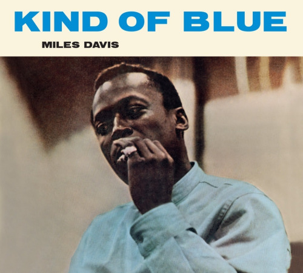
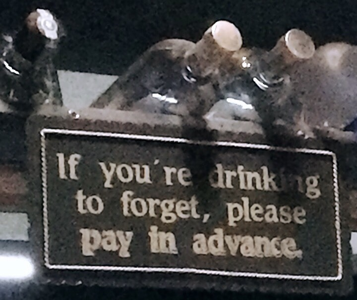
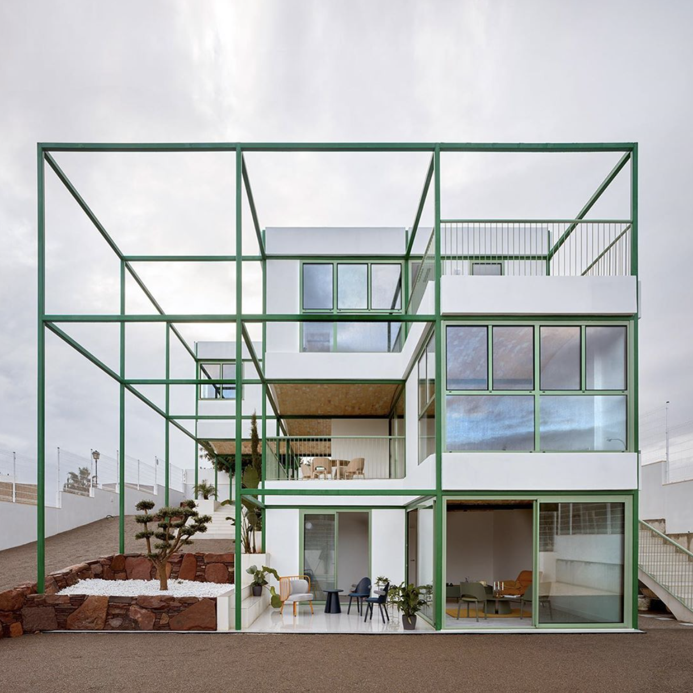
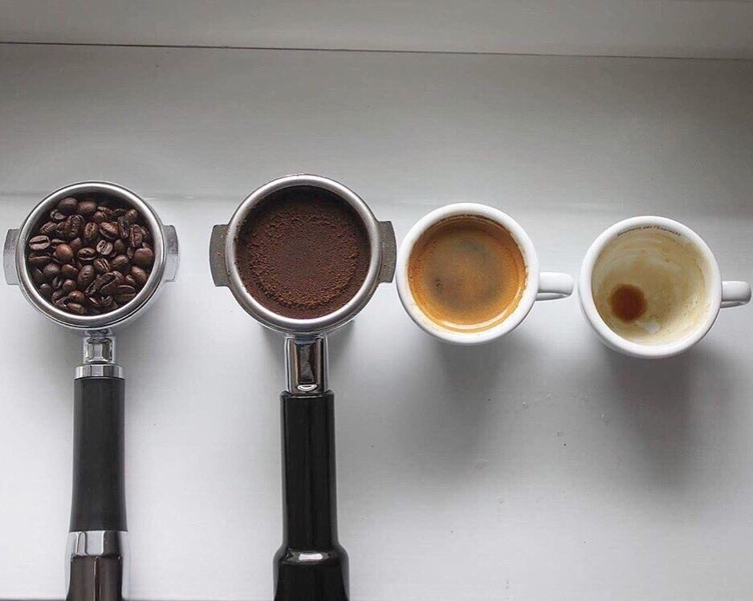

<script>document.title="lauretumblr"</script>

***

<div style="float: left; width: 50%;">
 <ul>
  
 </ul>
</div>

<div style="float: right; width: 50%;">
 <ul>
  
 </ul>
</div>

<div style="float: right; width: 50%;">
 <ul>
  
 </ul>
</div>

<div style="float: left; width: 50%;">
 <ul>
  
 </ul>
</div>

<div style="float: right; width: 50%;">
 <ul>
  
 </ul>
</div>

<div style="float: left; width: 50%;">
 <ul>
  
 </ul>
</div>

<div style="float: right; width: 50%;">
 <ul>
  
 </ul>
</div>

<div style="float: left; width: 50%;">
 <ul>
  
 </ul>
</div>

<div style="float: right; width: 50%;">
 <ul>
  
 </ul>
</div>

<div style="float: left; width: 50%;">
 <ul>
  
 </ul>
</div>

<div style="float: left; width: 50%;">
 <ul>
  
 </ul>
</div>

<div style="float: right; width: 50%;">
 <ul>
  
 </ul>
</div>

<div style="float: right; width: 50%;">
 <ul>
  
 </ul>
</div>

<div style="float: left; width: 50%;">
 <ul>
  
 </ul>
</div>

<div style="float: right; width: 50%;">
 <ul>
  
 </ul>
</div>

<div style="float: left; width: 50%;">
 <ul>
  
 </ul>
</div>

<div style="float: right; width: 50%;">
 <ul>
  
 </ul>
</div>

<div style="float: left; width: 50%;">
 <ul>
  
 </ul>
</div>

<div style="float: left; width: 50%;">
 <ul>
  
 </ul>
</div>

<div style="float: right; width: 50%;">
 <ul>
  
 </ul>
</div>

<div style="float: left; width: 50%;">
 <ul>
  
 </ul>
</div>

<div style="float: right; width: 50%;">
 <ul>
  
 </ul>
</div>

<div style="float: left; width: 50%;">
 <ul>
  
 </ul>
</div>

<div style="float: left; width: 50%;">
 <ul>
  
 </ul>
</div>

<div style="float: right; width: 50%;">
 <ul>
  
 </ul>
</div>

<div style="float: right; width: 50%;">
 <ul>
  
 </ul>
</div>

<div style="float: left; width: 50%;">
 <ul>
  
 </ul>
</div>

<div style="float: left; width: 50%;">
 <ul>
  
 </ul>
</div>

<div style="float: right; width: 50%;">
 <ul>
  
 </ul>
</div>

<div style="float: right; width: 50%;">
 <ul>
  
 </ul>
</div>

<div style="float: left; width: 50%;">
 <ul>
  
 </ul>
</div>

<div style="float: right; width: 50%;">
 <ul>
  
 </ul>
</div>

<div style="float: left; width: 50%;">
 <ul>
  
 </ul>
</div>

<div style="float: left; width: 50%;">
 <ul>
  
 </ul>
</div>

<div style="float: right; width: 50%;">
 <ul>
  
 </ul>
</div>

<div style="float: left; width: 50%;">
 <ul>
  
 </ul>
</div>

<div style="float: right; width: 50%;">
 <ul>
  
 </ul>
</div>

<div style="float: left; width: 50%;">
 <ul>
  
 </ul>
</div>

<div style="float: left; width: 50%;">
 <ul>
  
 </ul>
</div>

<div style="float: right; width: 50%;">
 <ul>
  
 </ul>
</div>

<div style="float: left; width: 50%;">
 <ul>
  
 </ul>
</div>

<div style="float: right; width: 50%;">
 <ul>
  
 </ul>
</div>

<div style="float: left; width: 50%;">
 <ul>
  
 </ul>
</div>

<div style="float: right; width: 50%;">
 <ul>
  
 </ul>
</div>

<div style="float: left; width: 50%;">
 <ul>
  
 </ul>
</div>

<div style="float: right; width: 50%;">
 <ul>
  
 </ul>
</div>

<div style="float: left; width: 50%;">
 <ul>
  
 </ul>
</div>

<div style="float: right; width: 50%;">
 <ul>
  
 </ul>
</div>

<div style="float: right; width: 50%;">
 <ul>
  
 </ul>
</div>

<div style="float: left; width: 50%;">
 <ul>
  
 </ul>
</div>

<div style="float: right; width: 50%;">
 <ul>
  
 </ul>
</div>

<div style="float: right; width: 50%;">
 <ul>
  
 </ul>
</div>

<div style="float: left; width: 50%;">
 <ul>
  
 </ul>
</div>

<div style="float: right; width: 50%;">
 <ul>
  
 </ul>
</div>

<div style="float: left; width: 50%;">
 <ul>
  
 </ul>
</div>

<div style="float: right; width: 50%;">
 <ul>
  
 </ul>
</div>

<div style="float: left; width: 50%;">
 <ul>
  
 </ul>
</div>

<div style="float: right; width: 50%;">
 <ul>
  
 </ul>
</div>

<div style="float: right; width: 50%;">
 <ul>
  
 </ul>
</div>

<div style="float: left; width: 50%;">
 <ul>
  
 </ul>
</div>

<div style="float: right; width: 50%;">
 <ul>
  
 </ul>
</div>

<div style="float: left; width: 50%;">
 <ul>
  
 </ul>
</div>

<div style="float: right; width: 50%;">
 <ul>
  
 </ul>
</div>

<div style="float: left; width: 50%;">
 <ul>
  
 </ul>
</div>

<div style="float: right; width: 50%;">
 <ul>
  
 </ul>
</div>

<div style="float: left; width: 50%;">
 <ul>
  
 </ul>
</div>

<div style="float: left; width: 100%;">
 <ul>
  <h4>[Return to main page](http://leg.ufpr.br/~henrique)</h4>
  ***
```{r}
Sys.time()
```
 </ul>
</div>
