```{r, echo=FALSE}

if (!requireNamespace('knitr', quietly=TRUE)) install.packages('knitr')
library(knitr)
options(width=100)
knitr::opts_chunk$set(fig.path='figures/', fig.align='center',
                      ## dev=c('pdf', 'png'),
                      warning=FALSE, message=FALSE, prompt=FALSE,
                      echo=FALSE, comment=NA)

```

***

> A linear model with two covariates seen at the same time in terms of
> both (3d).

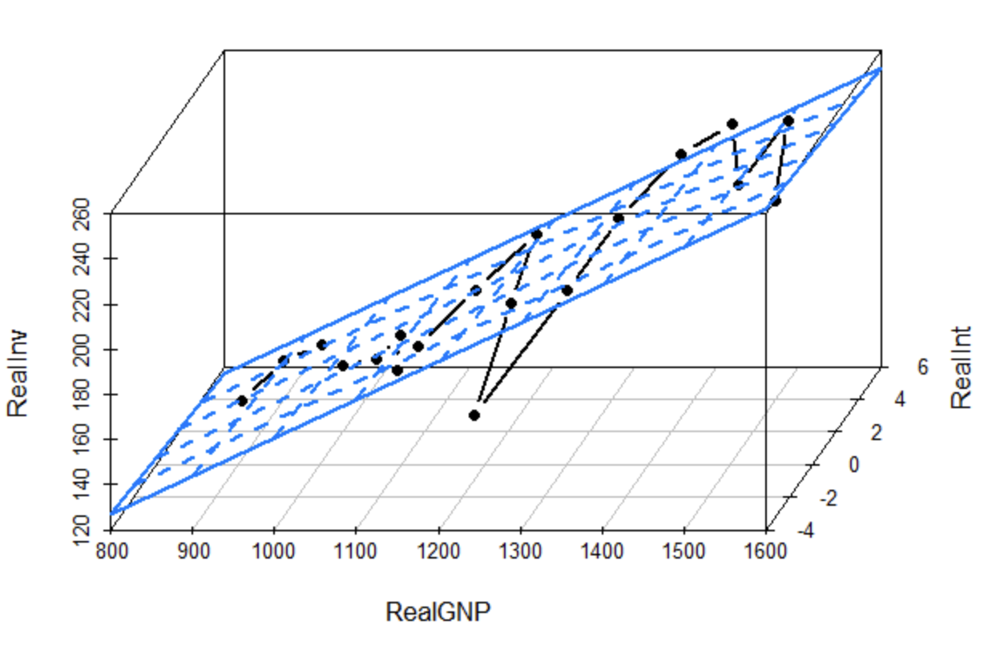{width=70%}

***

> US Real interest ex-post trimester time series from 1961 until 1986,
> with empiric M-fluctuation process based on the scores of a fitted
> model (break/change points).

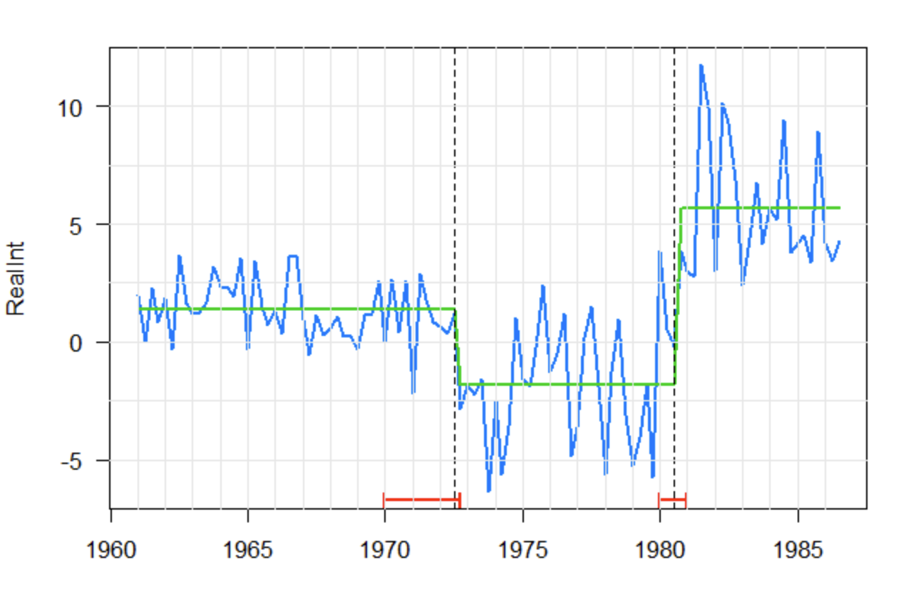{width=60%}

***

> The curve fits obtained through each gradient descent iteration until
> convergence, in red.

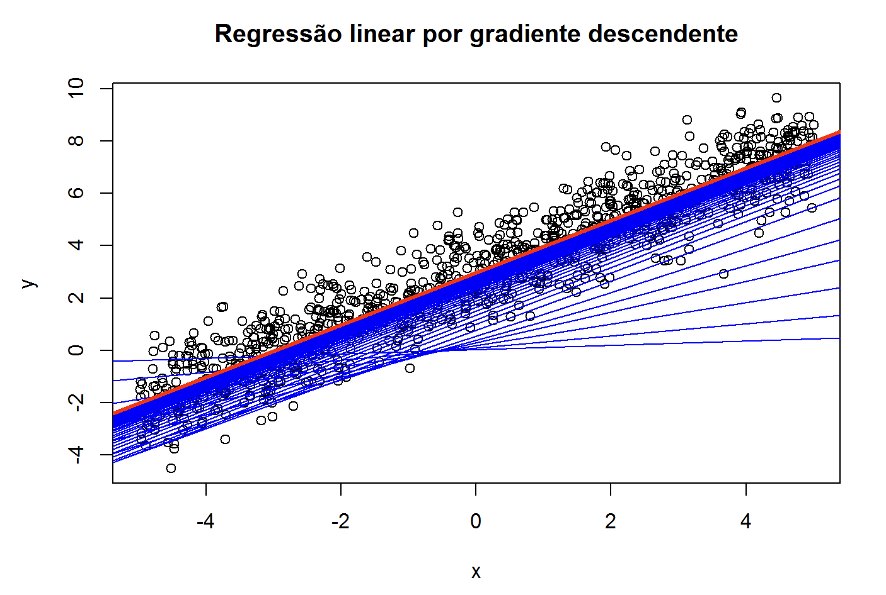{width=65%}

***

> Sequential Bayesian learning of a simple linear model with one
> covariate.

{width=70%}

***

> Clustering results of the DbScan algorithm for different *minpts*
> parameter values.

{width=70%}

***

> Clustering results of the DbScan algorithm for different *eps*
> parameter values.

{width=70%}

***

> A: Deviance contour of the quadritic approximation for a bivariate
> Gaussian with zero mean;
>
> B: Quadratic approx. added into the original likelihood-based deviance
> contour.

{width=75%}

***

> Deviance contours for a bivariate Gaussian with zero mean.

{width=75%}

***

> Deviance contours with the parameters estimate at each optimization
> algorithm function evaluation.

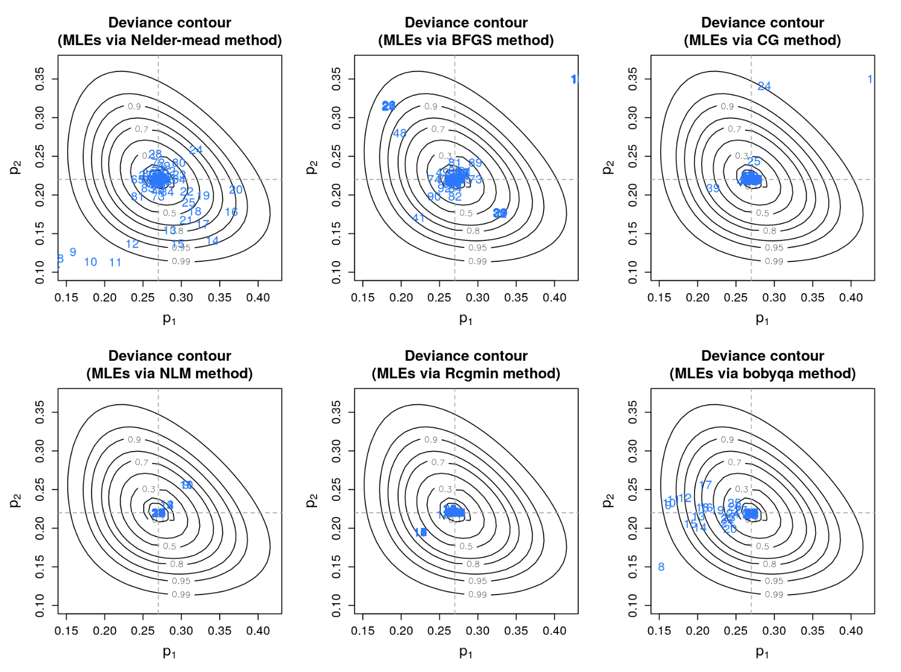{width=80%}

***

> Posterior mean and 95% credible interval of a random walk model of 1st
> order for smoothing splines without intercept.

{width=70%}

***

> Spider plots.

{width=80%}

{width=80%}

***

> Buffon's (500) needles problem.

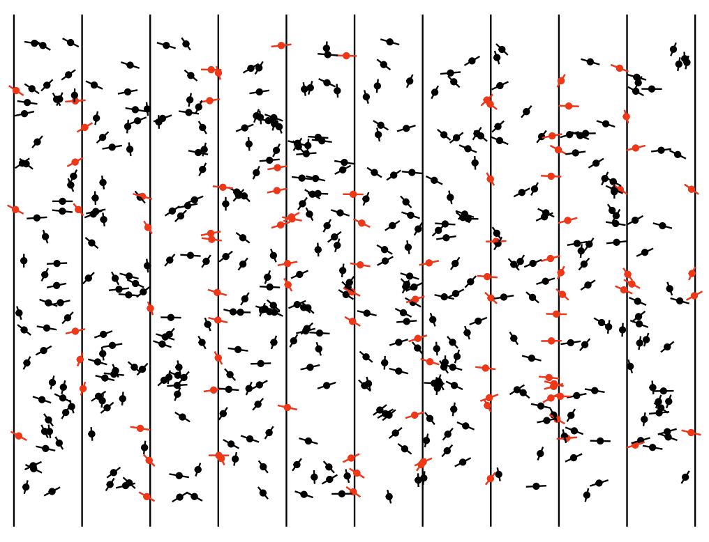{width=70%}

{width=70%}

***

> Logistic regression (binomial generalized linear model with logistic
> link function) stratified by a covariate and with 95% confidence
> bands.
>
> A) whole dataset; B) model fitting without the three biggest outliers.

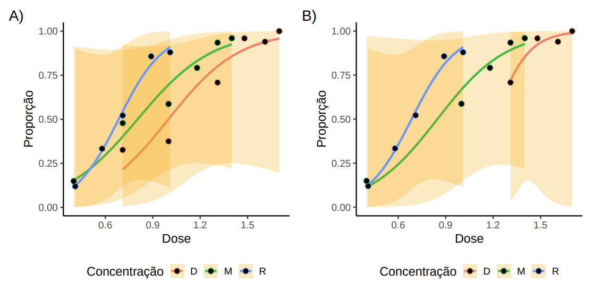{width=70%}

***

> Boxplot and histograms with some extra descriptive measures of the
> marathon times of 40 guys.

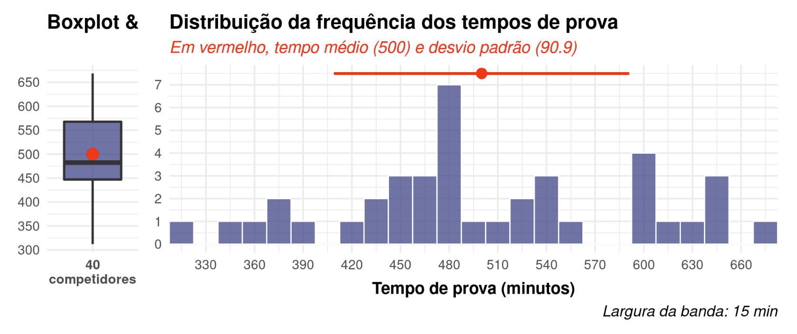{width=80%}

***

> Pre and post-competition body measures.

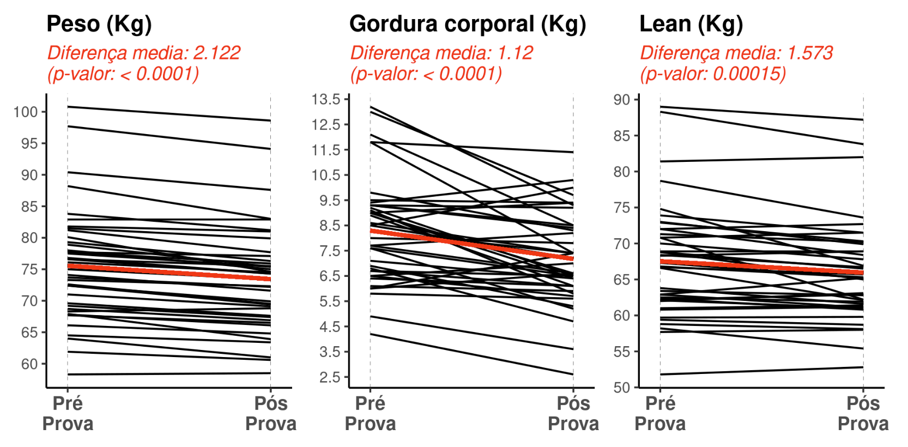{width=75%}

***

> Heatmap of pains distribution in a group of 98 elderlies during the
> COVID-19 pandemic.

{width=80%}

***

> Malaria incidence versus relative humidity in a five years period in
> the Amazon biome.

{width=80%}

{width=80%}

***

> WHO severity score distribuitionof 206 pacients.

{width=60%}

***

> Heatmap of adverse effects (meta-analysis).

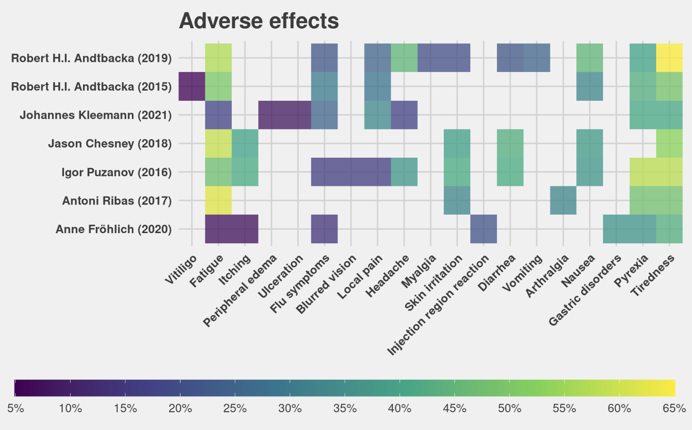{width=80%}

***

> Prevalence of neoplasias in hospitalizations in Curitiba's health
> regional, Paraná state.

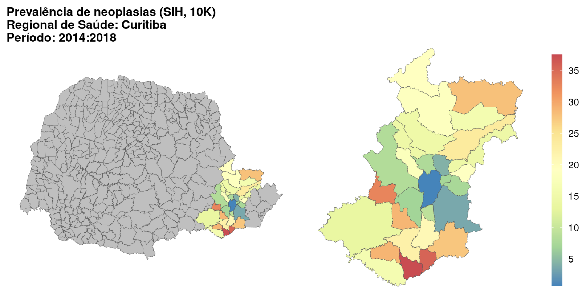{width=80%}

***

> Heatmap of correlations.

{width=75%}

***

> Prevalence of anomalies in ambulatorial calls in Paraná state, by
> municipality and by health regionals.

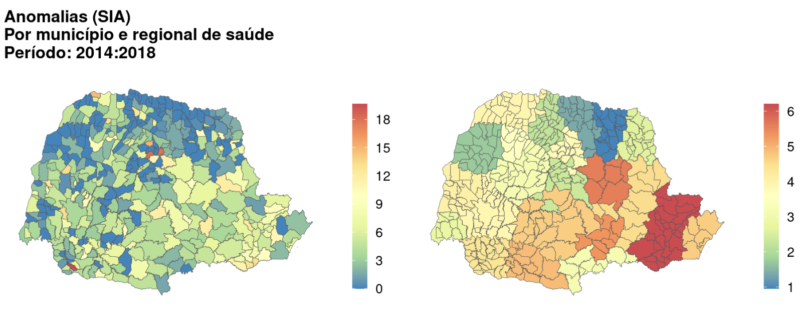{width=80%}

***

> Average prevalences in the Paraná state by health regionals.

{width=80%}

***

> Impact Hazard Index for relative humidity, a PCA made from several
> variables.

{width=70%}

***

> Paraná state (Brazil) map.

{width=70%}

***

> Barplots of comorbidities.

{width=95%}

***

> Confusion matrix of two different (outcomes) logistic regressions
> (binomial GLM with logit link function).

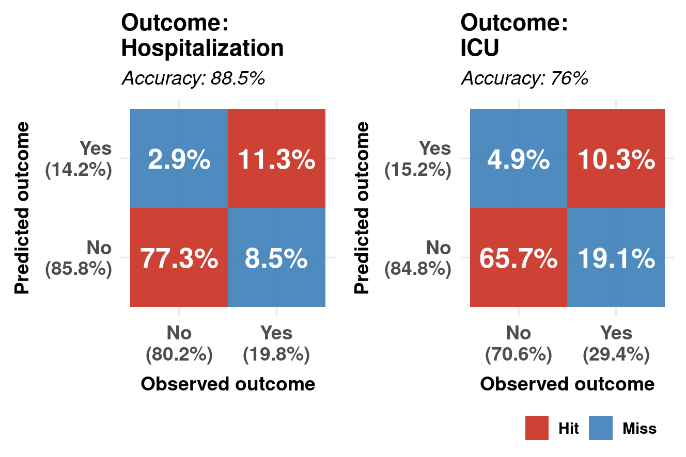{width=70%}

***

> Barplot and heatmap of long-term symptoms in a group of people who had
> COVID-19.

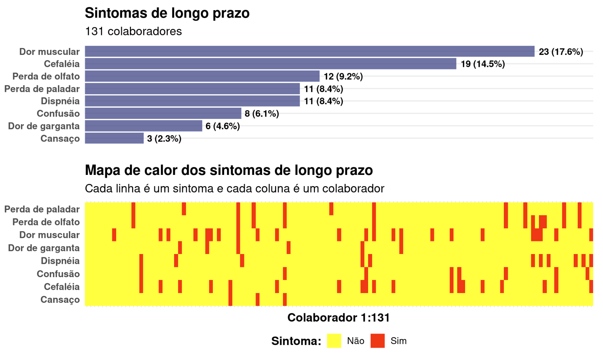{width=95%}

***

> Heatmaps of presented symptoms during and long-term in a group of
> people who had COVID-19.

{width=90%}

***

> Symptoms split-barplot of during/long-term outcomes in a group of
> people who had COVID-19.

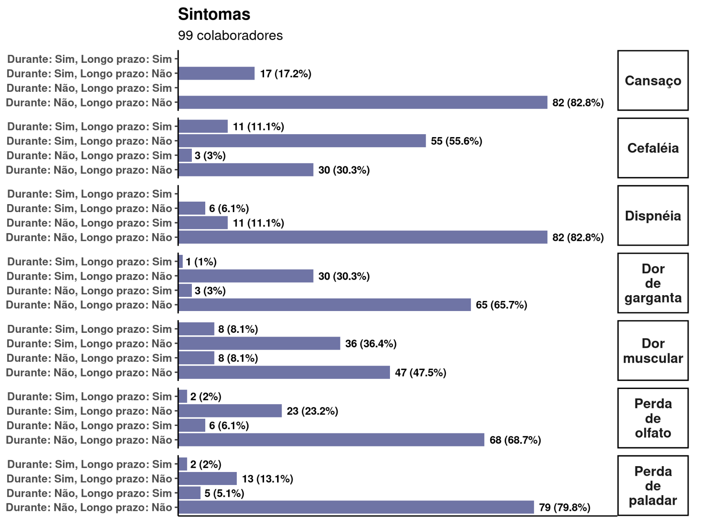{width=90%}
