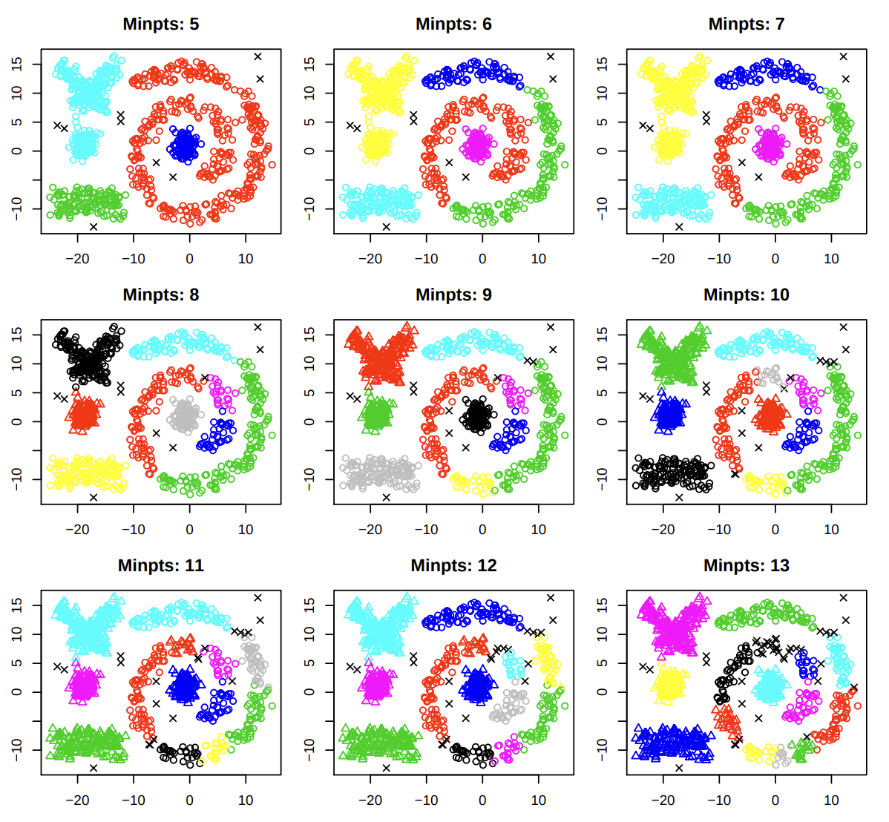
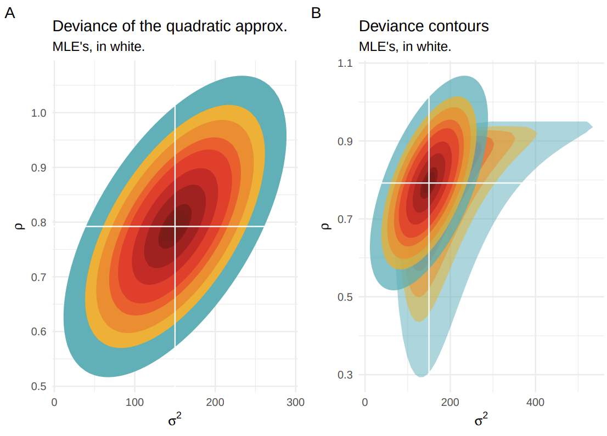

```{r, echo=FALSE}

if (!requireNamespace('knitr', quietly=TRUE)) install.packages('knitr')
library(knitr)
options(width=100)
knitr::opts_chunk$set(fig.path='figures/', fig.align='center',
                      ## dev=c('pdf', 'png'),
                      warning=FALSE, message=FALSE, prompt=FALSE,
                      echo=FALSE, comment=NA)

```

***

> A linear model with two covariates seen at the same time in terms of
> both (3d).

{width=70%}

***

> US Real interest ex-post trimester time series from 1961 until 1986,
> with empiric M-fluctuation process based on the scores of a fitted
> model (break/change points).

{width=60%}

***

> The curve fits obtained through each gradient descent iteration until
> convergence, in red.

{width=65%}

***

> Sequential Bayesian learning of a simple linear model with one
> covariate.

{width=70%}

***

> Clustering results of the DbScan algorithm for different *minpts*
> parameter values.

{width=70%}

***

> Clustering results of the DbScan algorithm for different *eps*
> parameter values.

{width=70%}

***

> A: Deviance contour of the quadritic approximation for a bivariate
> Gaussian with zero mean;
>
> B: Quadratic approx. added into the original likelihood-based deviance
> contour.

{width=75%}

***

> Deviance contours for a bivariate Gaussian with zero mean.

{width=75%}

***

> Deviance contours with the parameters estimate at each optimization
> algorithm function evaluation.

{width=80%}

***

> Posterior mean and 95% credible interval of a random walk model of 1st
> order for smoothing splines without intercept.

{width=70%}
